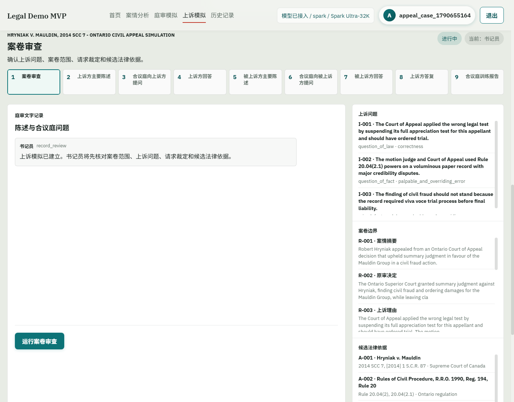
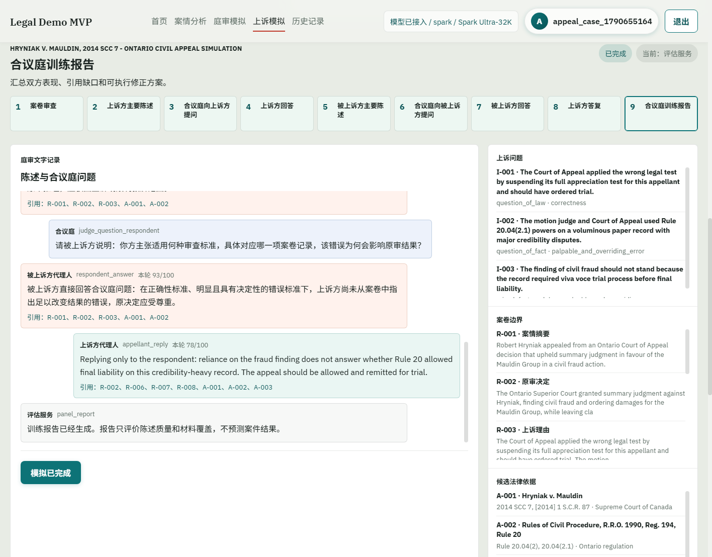
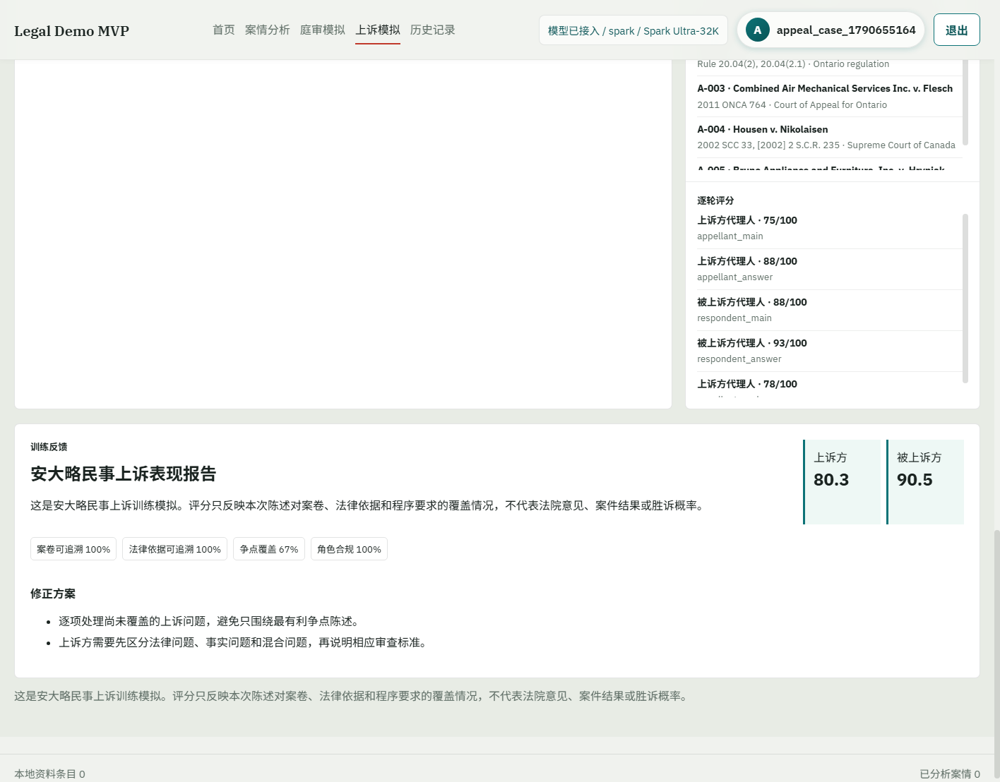
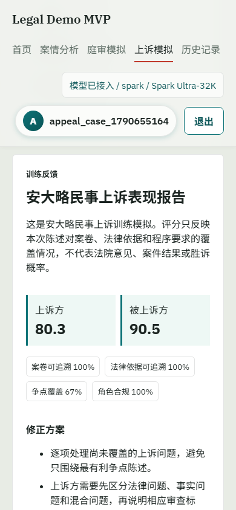

# 加拿大真实案例上诉模拟测评：Hryniak v. Mauldin

检查日期：2026-09-29
测试对象：安大略民事上诉模拟文本版
案件：`Hryniak v. Mauldin, 2014 SCC 7, [2014] 1 S.C.R. 87`
诉讼用语：本案为民事上诉，报告使用“上诉方”和“被上诉方”，不使用刑事语境中的“被控诉方”。

## 1. 结论

真实案例九阶段流程已完成，案卷审查、双方陈述、合议庭提问、回答、上诉方答复和训练报告均正常运行。页面载入 3 项上诉问题、9 项案卷记录和 5 项法律依据；最终产生 10 条庭审消息、5 次代理人评分和 39 条工具审计记录。桌面与移动页面均无横向溢出。

本次评分只衡量陈述结构、案卷引用、法律依据、问题覆盖和角色边界，不评价真实案件胜诉概率。真实裁判结果是加拿大最高法院驳回 Hryniak 的上诉并判其承担费用；模拟中“我方”扮演上诉方，属于逆着已知结果进行的律师训练。

外部网页能力应准确描述为：本次先通过外部检索核对公开判决、双方 factum 和法规，再把带来源 URL 的法律依据快照放入隔离测试库。庭审角色可以读取这些快照，但当前产品内的 Agent 不会自行访问互联网。因而“能读取外部来源内容并追踪 URL”已验证，“每个 Agent 自主联网搜索网页”尚未实现，不能写成已完成能力。

## 2. 真实来源

| 材料 | 本次用途 | 公开来源 |
| --- | --- | --- |
| 加拿大最高法院判决 | 案件身份、争点、审查标准、最终裁判 | [Hryniak v. Mauldin, 2014 SCC 7](https://scc-csc.lexum.com/scc-csc/scc-csc/en/item/13427/index.do?pedisable=true&q=hryniak&site_preference=mobile) |
| 上诉方 factum | Hryniak 的上诉理由和对 `full appreciation` 方法的质疑 | [Appellant Robert Hryniak Factum](https://www.scc-csc.gc.ca/pdf/case-documents/34641/FM010_Appellant_Robert-Hryniak.pdf) |
| 被上诉方 factum | Mauldin Group 对案卷充分性和无需发回审理的答辩 | [Respondents Fred Mauldin et al. Factum](https://www.scc-csc.ca/pdf/case-documents/34641/FM020_Respondents_Fred-Mauldin-et-al.pdf) |
| 安大略民事诉讼规则 | Rule 20 简易判决的成文法依据 | [Rules of Civil Procedure, R.R.O. 1990, Reg. 194](https://www.ontario.ca/laws/regulation/900194) |
| 安大略上诉法院判决 | `full appreciation` 方法和下级审经过 | [Combined Air Mechanical Services Inc. v. Flesch, 2011 ONCA 764](https://www.minicounsel.ca/oca/2011/764) |
| 加拿大最高法院判决 | 法律、事实及混合问题的审查标准 | [Housen v. Nikolaisen, 2002 SCC 33](https://scc-csc.lexum.com/scc-csc/scc-csc/en/1972/1/document.do) |
| 原审合并裁判 | 简易判决和民事欺诈认定的下级审来源 | [Bruno Appliance and Furniture, Inc. v. Hryniak, 2010 ONSC 5490](https://www.canlii.org/en/on/onsc/doc/2010/2010onsc5490/2010onsc5490.html) |

法规页面用于核对当前公开文本，历史案件仍需结合 2010 年修订后、案件审理时适用的 Rule 20。当前测试没有接入判例负面处理或法规生效日期的在线 citator，因此不把“来源 URL 可访问”写成“持续有效性已经完全验证”。

## 3. 案件事实与证据

Mauldin Group 在 2001 年 6 月与 Hryniak、Cranston、Peebles 会面后投资 120 万美元。资金经 Cassels Brock 和 Hryniak 控制的 Tropos 流转，随后转往境外并消失。投资人以民事欺诈为由起诉，并申请简易判决。

本案不是简单的小额书面争议。18 名证人提交宣誓书，交叉询问持续三周，动议案卷有 28 卷证据，口头辩论持续四天。动议法官运用 Rule 20.04(2.1) 的权力衡量证据、评估可信性并作出推论，最终只对 Hryniak 作出简易判决；对 Peebles 和 Cassels Brock 的请求仍需审理。

安大略上诉法院认为这类复杂记录通常不适合简易判决，但仍认为记录足以支持 Hryniak 构成民事欺诈，因此驳回他在 Mauldin 案中的上诉。加拿大最高法院进一步否定对 `full appreciation` 的过度依赖，认为现有程序足以作出公平、公正且合比例的裁判，最终驳回上诉并判令费用由上诉方承担。

## 4. 双方主张与真实裁判

### 我方上诉理由

1. 上诉法院先提出通常要求开庭审理的 `full appreciation` 方法，却没有把该方法一致地用于 Hryniak，构成法律测试适用错误。
2. 案卷庞大、可信性争议突出，Rule 20.04(2.1) 的证据衡量和可信性判断权不应替代完整审理。
3. 民事欺诈认定依赖事实和混合问题，应当说明可识别的法律错误，或达到“明显且具有决定性错误”的干预门槛。
4. 请求撤销简易判决，将 Mauldin action 发回审理。

### 被上诉方答辩

1. 上诉法院不是对 Hryniak 作“前瞻性推翻”，而是在完整审查现有记录后确认欺诈认定无需再审。
2. 动议法官审阅了大量证人材料、交叉询问记录和 28 卷证据，已具备判断 Hryniak 责任所需的记录。
3. 即使其他被告仍需审理，也不表示对 Hryniak 的责任必须一并重审；发回只会增加时间和费用。
4. 对 Rule 20 法律原则的纯法律错误适用正确性审查，但是否行使新事实认定权通常属于酌情或混合问题，应受到尊重。

### 法院判决

加拿大最高法院认为，简易判决能够使法官作出必要事实认定、把法律适用于事实，并且比完整审理更合比例、更快捷、更经济时，就不必开庭审理。法院认定本案记录足以公平、公正地处理 Hryniak 的责任，动议法官的事实认定有证据支持，因此驳回上诉并判令费用由 Hryniak 承担。

## 5. 九阶段执行流

| 阶段 | 执行者 | 输入或产出 | 停止边界 |
| --- | --- | --- | --- |
| 1. 案卷审查 | 书记员 | 固化 3 个争点、9 项案卷和 5 项依据 | 不发表实体胜败意见 |
| 2. 上诉方主要陈述 | 我方律师 | 提出法律测试、案卷复杂性和发回请求 | 不新增案卷外事实 |
| 3. 合议庭向上诉方提问 | 合议庭 | 追问审查标准、案卷位置和决定性影响 | 只提问，不替任一方补论证 |
| 4. 上诉方回答 | 我方律师 | 回答法律问题与事实问题采用何种标准 | 必须对应已有问题 |
| 5. 被上诉方主要陈述 | 对方律师 | 主张记录充分、应维持裁判 | 不替上诉方完善理由 |
| 6. 合议庭向被上诉方提问 | 合议庭 | 检验尊重原审和结果影响 | 只提问，不形成裁判结论 |
| 7. 被上诉方回答 | 对方律师 | 说明上诉方未达到干预门槛 | 必须对应已有问题 |
| 8. 上诉方答复 | 我方律师 | 只回应“记录充分”这一新点 | 不增加新的上诉理由 |
| 9. 训练报告 | 评估服务 | 汇总逐轮分数、缺口和修正动作 | 不输出判决或胜诉概率 |

完整数据流为：外部公开来源检索与核对 → 带 URL 的依据快照 → 创建隔离案卷 → 书记员固化范围 → 双方和合议庭按阶段读取案卷/依据/庭审记录 → 验证服务检查引用 ID 和角色边界 → 评估服务逐轮计分 → 汇总训练报告。

## 6. Agent 职责与工具审计

| Agent | 允许工具 | 本次实际调用 | 边界结果 |
| --- | --- | --- | --- |
| `court_clerk` | `workflow_state`, `record_read`, `authority_read` | 各 1 次 | 只整理范围，合规 |
| `appellant_counsel` | `record_read`, `authority_read`, `transcript_read` | 各 3 次 | 仅在我方三个发言阶段运行，合规 |
| `respondent_counsel` | `record_read`, `authority_read`, `transcript_read` | 各 2 次 | 仅在对方两个发言阶段运行，合规 |
| `judge_panel` | `record_read`, `authority_read`, `transcript_read`, `question_issue` | 案卷、依据和提问各 2 次 | 只提问，未输出裁判结论 |
| `verification_service` | `reference_validation` | 7 次 | 只校验引用和角色，不判断实体胜败 |
| `evaluation_service` | `score_turn`, `build_report` | 逐轮评分 7 次、报告 1 次 | 只做训练评分，不输出概率 |

本次共有 39 条审计记录。所有已引用的 `record_id`、`authority_id` 和问题 ID 均来自当前案卷，没有未知引用，也没有角色越界。`authority_read` 读取的是带网页 URL 和摘要的测试快照，不等同于实时 `web_search` 或 `web_fetch`。

## 7. 综合评分

| 项目 | 结果 | 说明 |
| --- | ---: | --- |
| 我方上诉律师综合分 | 80.3 | 主要陈述 75，回答 88，答复 78 |
| 被上诉方律师综合分 | 90.5 | 主要陈述 88，回答 93 |
| 案卷可追溯 | 100% | 评分主张均绑定案卷材料 |
| 法律依据可追溯 | 100% | 评分主张均绑定候选判例或法规 |
| 上诉问题覆盖 | 66.7% | 第三项民事欺诈认定争点未被完整处理 |
| 角色合规 | 100% | 未发现越界工具或越界发言 |
| 无效引用 | 0 | 没有引用案卷外 ID |

这些数字是训练评分，不是司法正确率。真实结果对我方不利，也说明被上诉方在本案记录和现行先例下具有更强的实体立场。

## 8. 我方律师团队修正方案

我方主要问题不是“没有引用”，而是审查标准没有分层。主要陈述同时覆盖法律问题和混合问题，却没有明确说：Rule 20 的纯法律解释按正确性审查；是否行使新事实认定权通常受到尊重；民事欺诈事实或混合认定需要指出明显且具有决定性的错误，除非能剥离出纯法律错误。因此主要陈述和答复中的标准分没有拿满。

第二个问题是第三项争点没有完成。后续答复只围绕“记录是否足够”展开，没有具体说明民事欺诈的哪一个构成要件被错误认定、对应哪一段案卷、为什么该错误会改变结论。改进时应把主张改成可核对的三段式：错误类型 → 精确案卷位置 → 对裁判结果的影响。

更合适的陈述框架是：先承认 Hryniak 对简易判决采取宽解释，避免与控制性先例正面冲突；再把争议收窄到动议法官是否错误运用“interest of justice”边界，以及是否存在可剥离的欺诈法律要件错误。若无法从案卷指出这一错误，应明确建议客户不要继续主张发回审理，而不是靠程序复杂性本身推导必然需要审判。

## 9. 截图

初始案卷与法律依据：



完成后的庭审工作区：



桌面训练报告：



移动端训练报告：



## 10. 本次卡住问题与修复

2026-09-28 16:50 启动的临时 Uvicorn 进程 PID `40860` 一直监听 `8016`，服务日志只有“startup complete”，没有任何后续 HTTP 请求。问题不在庭审状态机，而在外围执行链：手工启动后台服务后，没有健康检查后的下一阶段确认、总超时、失败阶段日志和 `finally` 清理，因此后台进程存活但任务没有继续。

修复后由 `scripts/run_appeal_real_case_e2e.py` 统一管理服务、API、浏览器和截图：服务启动、单次请求、浏览器加载分别有超时；九阶段最多推进 12 次；异常会写出 `failed_stage`；无论成功失败都会关闭 Edge 和 Uvicorn。本次最终运行约 9 秒，日志明确记录两个进程均已停止。

有界执行器第一次运行还发现了独立的真实缺陷：全新 SQLite 只创建 `users`，没有创建注册流程必写的 `user_profiles`，导致 `/api/auth/register` 返回 500。现已在 SQLite 初始化中补齐该表，并增加全新数据库注册和重复初始化测试。

## 11. 可复现测试

```powershell
python scripts\test_sqlite_auth_init.py
python scripts\test_appeal_real_case_hryniak.py
python scripts\test_appeal_workflow.py
python scripts\run_appeal_real_case_e2e.py --startup-timeout 25 --request-timeout 15 --browser-timeout 30
python -m compileall -q app scripts
```

结果：SQLite 初始化测试 2 项通过，真实案例专项 1 项通过，上诉流程回归 26 项通过，真实浏览器端到端流程通过，Python 编译检查通过。

## 12. 剩余边界

当前尚未完成生产级实时网页工具。下一步应把 `web_search`、`web_fetch`、`statute_lookup` 和判例有效性检查做成独立研究服务，由书记员或研究 Agent 调用；庭审双方只能读取经过快照、哈希、抓取时间和来源域名校验的材料。验证 Agent 应检查引文与网页快照的一致性，但不负责决定法律主张是否正确；最终仍需法律专业人员复核。
