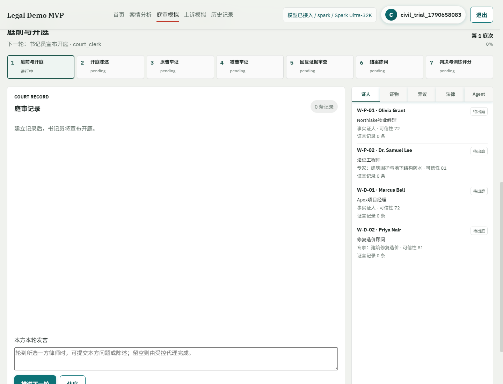
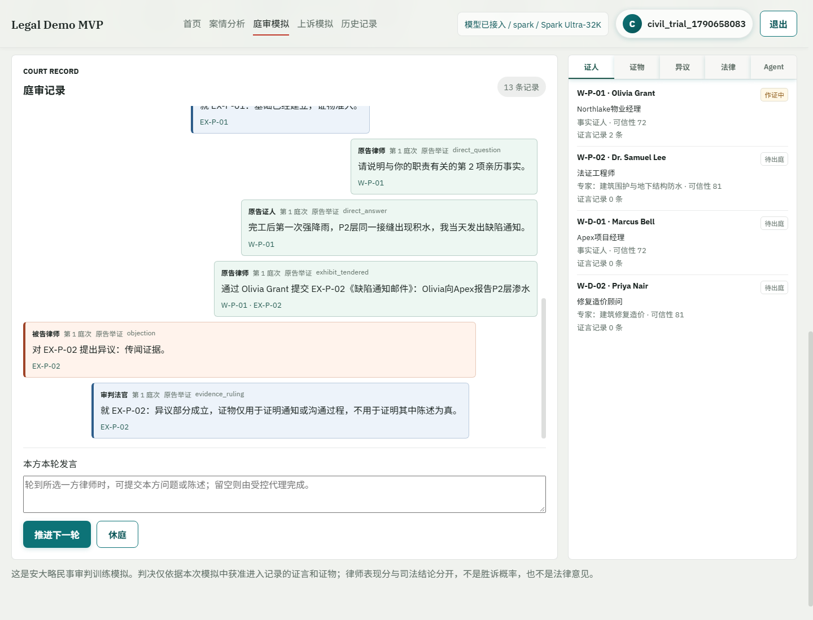
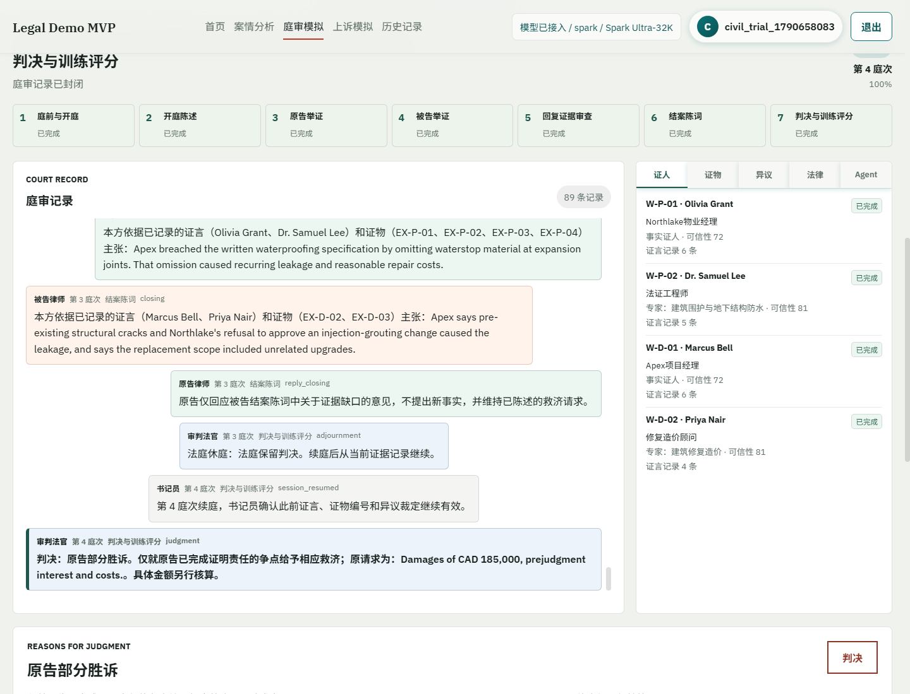
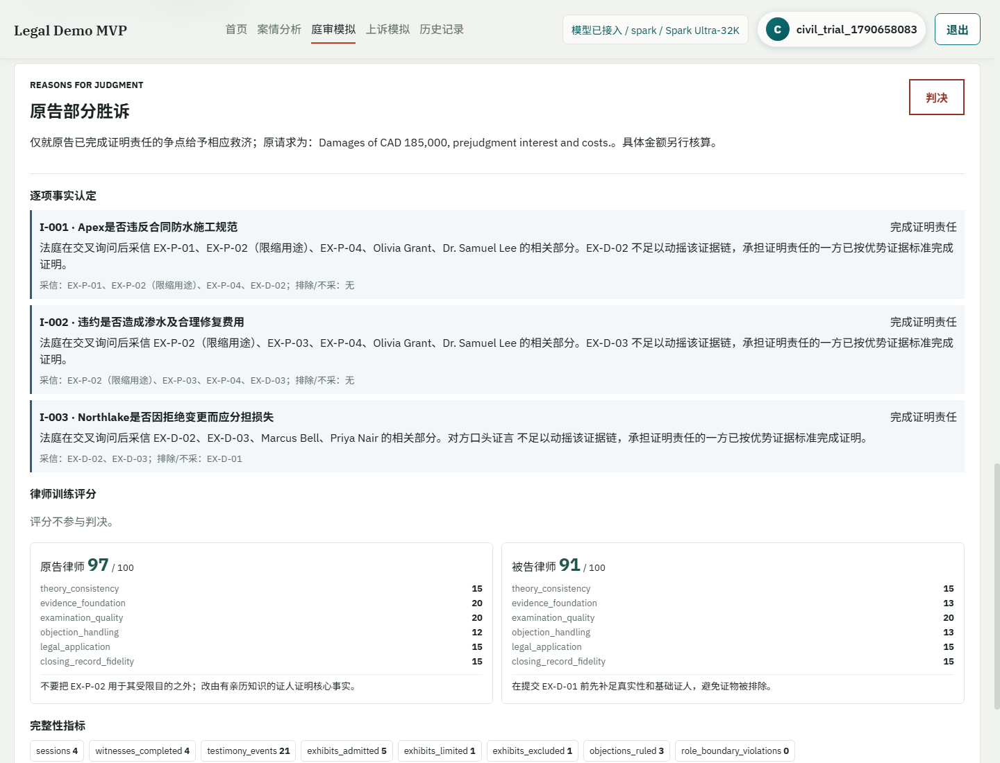
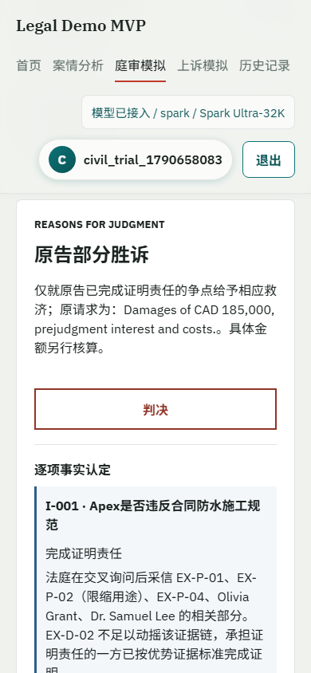

# 安大略民事审判模拟：流程设计与测试报告

## 1. 本次修正

原 `/hearing` 实现把“举证质证”压缩成一次对话提交，无法表示证人出庭、主询问、交叉询问、复询、证物提交、异议和续庭。该实现更接近阶段清单，不是事实审理。

本次将事实审理与 `/appeal-simulation` 分开：

- `/hearing`：安大略民事一审，允许多庭次、多个证人和逐项证物裁定。
- `/appeal-simulation`：继续处理封闭案卷上的法律错误、审查标准和上诉救济，不在上诉口头辩论中重新传唤证人。
- 旧 `/api/hearing` 接口保留，新增 `/api/civil-trial` 接口，避免已有调用立即失效。

用户提供的知乎链接在当前执行环境返回反爬验证页，无法可靠读取正文。因此，本次没有假称引用其正文；流程采用用户明确提出的“多次开庭、举证、质证、多份证词、判决评分”结构，并按安大略官方程序资料校验。

## 2. 可执行流程

| 阶段 | 主要动作 | 完成条件 |
| --- | --- | --- |
| 庭前与开庭 | 建立争点、证人名册、证物目录和法律依据，书记员宣布开庭 | 案卷结构可追溯 |
| 开庭陈述 | 原告先陈述案件理论，被告回应 | 双方只作路线说明，不把陈述当证据 |
| 原告举证 | 逐名传唤；专家先做资格审查；每个证词要点分别主询问 | 每名证人完成主询问、交叉询问、有限复询并退庭 |
| 被告举证 | 与原告举证采用相同结构 | 被告宣布举证完毕 |
| 回复证据审查 | 法官判断是否出现无法预见的新事项 | 不允许借回复证据重新做一遍原告案件 |
| 结案陈词 | 双方只引用已经准入的证物和完成质证的证言 | 原告回复仅限被告提出的新点 |
| 判决与评分 | 逐争点分配证明责任、说明采信与排除理由、作出命令 | 判决和律师训练评分分别生成 |

原告举证、被告举证和保留判决后均设置自动休庭节点。休庭后调用普通推进接口会被拒绝，必须先“续庭”；续庭时书记员确认此前证言、证物编号和异议裁定继续有效。

## 3. Agent 职责与边界

| Agent | 职责 | 可调用工具 | 停止边界 |
| --- | --- | --- | --- |
| 书记员 | 庭次、证人和证物登记 | `session_control`、`witness_registry`、`exhibit_registry` | 不评价证明力，不裁定异议 |
| 原告律师 | 原告开庭陈述、主询问己方证人、盘问对方、提交证物和结案 | `record_read`、`authority_read`、`question_witness`、`tender_exhibit`、`raise_objection` | 不替证人回答，不决定异议 |
| 被告律师 | 与原告律师相反方向履行同类职责 | 同上 | 同上 |
| 事实证人 | 只回答个人证词记录中的事实 | `personal_record_read`、`answer_question` | 不检索网页、不引用法律、不代替律师辩论 |
| 专家证人 | 在已获准专业领域和报告范围内回答 | `expert_report_read`、`answer_question` | 不越出资格范围，不补造报告意见 |
| 证据核验代理 | 核对基础证人、真实性、来源和传闻风险 | `foundation_check`、`source_validation`、`exhibit_registry` | 只给核验结果，不作准入裁定 |
| 法律研究代理 | 使用 RAG 混合检索登记可追溯法律依据 | `hybrid_search`、`authority_read` | 不生成证言，不决定案件事实 |
| 审判法官 | 主持程序、专家资格、异议裁定和最终判决 | `transcript_read`、`authority_read`、`rule_objection`、`build_judgment` | 不替任何一方补证，不把训练分换算成裁判结果 |
| 训练评估代理 | 对双方律师庭审技能评分并提出修正动作 | `transcript_read`、`score_advocacy`、`build_report` | 不改变证据裁定或司法结论 |

不是所有 Agent 都应获得网页检索权限。特别是证人如果可以查法条或网页后再回答，就会污染证词。外部法律检索集中在法律研究代理和双方律师，网页来源以 URL 和来源状态写入案卷；证人只读自己的证词记录。

## 4. 举证质证规则

证物状态包括 `proposed`、`admitted`、`limited` 和 `excluded`。每件证物必须指定基础证人和关联争点：

- 基础证人不匹配或真实性基础不足：排除。
- 存在传闻风险且不满足商业记录条件：只作通知、沟通过程等限缩用途。
- 商业记录条件和其他基础已经建立：准入。
- 对方律师提出具体异议，证据核验代理只核验，最终状态只能由法官写入。

证言按 `direct_question/direct_answer`、`cross_question/cross_answer`、`reexamination_question/reexamination_answer` 保存。复询问题被限制在交叉询问产生的新事项，证人可以明确表示“不知道”或“不作推测”。

## 5. 判决和评分

司法结果按每个争点分别处理：谁承担证明责任、哪些证物获准、哪些证人完成质证、交叉询问暴露了什么限制，以及是否达到 `balance of probabilities`。界面不展示伪精确的“胜诉概率”，也不在判决理由中写算法证据分。

律师训练分满分 100，单独评价：案件理论一致性 15、证据基础 20、询问质量 20、异议处理 15、法律适用 15、结案陈词与记录一致性 15。训练分只用于指出改进动作，不参与法官判决。

## 6. 测试案卷

测试案卷为明确标注的虚构训练案 `Northlake Condo Corp. v. Apex Restoration Ltd.`，争议是地下车库防水工程是否违约、渗水因果关系、合理修复费用，以及业主拒绝变更是否构成损失分担依据。

- 原告证人：物业经理 Olivia Grant、法证工程师 Dr. Samuel Lee。
- 被告证人：项目经理 Marcus Bell、造价专家 Priya Nair。
- 证物：合同图纸、缺陷通知、修复发票、两份专家报告、手机截图和完工检查表。
- 覆盖裁定：普通准入、传闻限缩准入、真实性不足排除。

完整测试结果保存于 `tmp/civil_trial_northlake_result.json` 和 `tmp/civil_trial_e2e_result.json`。

## 7. 实测结果

| 指标 | 结果 |
| --- | --- |
| 庭次 | 4 |
| 完成作证的证人 | 4 |
| 庭审记录事件 | 89 |
| 证言回答 | 21 |
| 异议裁定 | 3 |
| 证物裁定 | 准入 5、限缩准入 1、排除 1 |
| 角色越界 | 0 |
| 判决 | 原告部分胜诉 |
| 律师训练分 | 原告 97、被告 91 |

法官就三个争点分别给出证明责任、采信证据、排除证据和可信性说明。原告证明施工规范违约及相应修复损失；被告就拒绝变更的损失分担争点完成其证明责任，因此结果为部分胜诉。具体损害金额留待按判决认定范围核算。

## 8. 截图

### 建立案卷



### 举证、异议与裁定



### 完整庭审记录



### 判决与评分



### 移动端



## 9. 复现命令

```powershell
python scripts\test_civil_trial_workflow.py
python scripts\run_civil_trial_e2e.py
python scripts\test_hearing_workflow.py
python scripts\test_appeal_workflow.py
python -m compileall -q app scripts
```

## 10. 程序依据与限制

- [Ontario Superior Court of Justice: Steps to a Civil Case](https://www.ontariocourts.ca/scj/guides-and-service-resources/guide-to-representing-yourself/civil-resources-to-help-self-represented-litigants/steps-to-civil-case/)：开庭陈述、原告先举证、主询问、交叉询问、复询、异议和结案陈词的顺序。
- [Ontario Rules of Civil Procedure](https://www.ontario.ca/laws/regulation/900194)：Rule 52 的审判程序和休庭，Rule 53 的口头证据、交叉询问及专家报告。
- [Ontario Evidence Act](https://www.ontario.ca/laws/statute/90e23)：证人能力和商业记录等证据规则。

本模块是训练系统，不是法院电子卷宗，也没有替代律师对实体法、证据法例外和实时法条有效性的核验。测试覆盖了本次定义的正常、异常、边界、权限隔离和浏览器场景，但不能宣称穷尽所有民事程序，例如陪审团审判、缺席审判、证人特权、翻译证人、远程出庭和复杂专家会议仍需单独建模。
